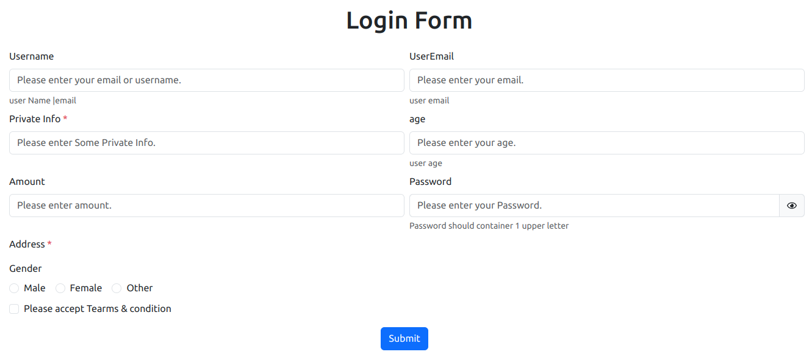

# searchinput_dynamic-form

React is a JavaScript library for creating user interfaces. In these library we can create the dynamic form with data of array.

- We can create the Search Input Option at front end side in react js.
- Create Dynamic form with help of array of object

## Installation

Install searchinput_dynamic-form with npm

```bash
 npm install searchinput_dynamic-form
 yarn add searchinput_dynamic-form
```
    
## Documentation
# Example

we have to pass the object From these 

    
    [
        {
            name: "username",
            type: "text",
            placeholder: "Please enter your email or username.",
            lable: "Username",
            validationobj: {
            required: {
                value: true,
                message: "Please pass the userName",
            },
            },
            somemsg: "user Name |email",
        },
        {
            name: "useremail",
            type: "email",
            placeholder: "Please enter your email.",
            lable: "UserEmail",
            validationobj: {
            required: {
                value: true,
                message: "Please pass the useremail",
            },
            },
            somemsg: "user email",
        },
        {
            name: "account",
            type: "secure",
            placeholder: "Please enter Some Private Info.",
            lable: "Private Info *",
            validationobj: {
            required: {
                value: true,
                message: "Please pass  Some Private Info.",
            },
            },
        },
        {
            name: "age",
            type: "number",
            placeholder: "Please enter your age.",
            lable: "age",
            validationobj: {
            required: {
                value: true,
                message: "Please pass the useremail",
            },
            min: {
                value: 0,
                message: "The age shoudl not be less than 0",
            },
            max: {
                value: 150,
                message: "The age shoudl not be greater than 150",
            },
            },
            somemsg: "user age",
        },
        {
            name: "amount",
            type: "float",
            placeholder: "Please enter amount.",
            lable: "Amount",
        },
        {
            name: "password",
            type: "password",
            placeholder: "Please enter your Password.",
            lable: "Password",
            validationobj: {
            required: {
                value: true,
                message: "Please pass the pass",
            },
            },
            somemsg: "Password should container 1 upper letter",
        },
        {
            name: "Address",
            type: "textarea",
            placeholder: "Please enter your Address.",
            lable: "Address * ",
            validationobj: {
            required: {
                value: true,
                message: "Please pass the address",
            },
            },
            maininputclass: "col-12 col-md-12",
        },
        {
            name: "gender",
            type: "radio",
            lable: "Gender",
            placeForLabel: "inline",
            validationobj: {
            required: {
                value: true,
                message: "Please select gender",
            },
            },
            options: [
            { label: "Male", value: "male" },
            { label: "Female", value: "female" },
            { label: "Other", value: "other" },
            ],
            maininputclass: "col-12 col-md-12",
        },
        {
            name: "accept",
            type: "checkbox",
            validationobj: {
            required: {
                value: true,
                message: "Please read tearms & condition",
            },
            },
            options: [
            { label: "Please accept Tearms & condition", value: true },
            ],
            maininputclass: "col-12 col-md-12",
        },
    ];
    

Here you can get the two Components
- Search Input 
- Dynamic Form.
- Table
- Calender

above example is Dynamic Form Example. You can find below attached screen shot to see it's output.


# Screen Shot


# implementation
```const formdetail =[
  {
    name: "username",
    type: "text",
    placeholder: "Please enter your email or username.",
    lable: "Username",
    validationobj: {
      required: {
        value: true,
        message: "Please pass the userName",
      },
    },
    somemsg: "user Name |email",
  },
  {
    name: "useremail",
    type: "email",
    placeholder: "Please enter your email.",
    lable: "UserEmail",
    validationobj: {
      required: {
        value: true,
        message: "Please pass the useremail",
      },
    },
    somemsg: "user email",
  },
  {
    name: "account",
    type: "secure",
    placeholder: "Please enter Some Private Info.",
    lable: "Private Info *",
    validationobj: {
      required: {
        value: true,
        message: "Please pass  Some Private Info.",
      },
    },
  },
  {
    name: "age",
    type: "number",
    placeholder: "Please enter your age.",
    lable: "age",
    validationobj: {
      required: {
        value: true,
        message: "Please pass the useremail",
      },
      min: {
        value: 0,
        message: "The age shoudl not be less than 0",
      },
      max: {
        value: 150,
        message: "The age shoudl not be greater than 150",
      },
    },
    somemsg: "user age",
  },
  {
    name: "amount",
    type: "float",
    placeholder: "Please enter amount.",
    lable: "Amount",
  },
  {
    name: "password",
    type: "password",
    placeholder: "Please enter your Password.",
    lable: "Password",
    validationobj: {
      required: {
        value: true,
        message: "Please pass the pass",
      },
    },
    somemsg: "Password should container 1 upper letter",
  },
  {
    name: "Address",
    type: "textarea",
    placeholder: "Please enter your Address.",
    lable: "Address * ",
    validationobj: {
      required: {
        value: true,
        message: "Please pass the address",
      },
    },
    maininputclass: "col-12 col-md-12",
  },
  {
    name: "gender",
    type: "radio",
    lable: "Gender",
    placeForLabel: "inline",
    validationobj: {
      required: {
        value: true,
        message: "Please select gender",
      },
    },
    options: [
      { label: "Male", value: "male" },
      { label: "Female", value: "female" },
      { label: "Other", value: "other" },
    ],
    maininputclass: "col-12 col-md-12",
  },
  {
    name: "accept",
    type: "checkbox",
    validationobj: {
      required: {
        value: true,
        message: "Please read tearms & condition",
      },
    },
    options: [
      { label: "Please accept Tearms & condition", value: true },
    ],
    maininputclass: "col-12 col-md-12",
  },
];
```

const formvaluessubmit = (data: object) => {
    console.log(data, "form app");
  };
  const formValue = (data: object) => {
    console.log(data,'data form');
  };

```bash
<DynamicForm formValues={formValue} formTitle={'Login Form'} titlePosition="center" formDetails={formdetail}  formclass={`row row-cols-1 row-cols-md-2`}  submitfn={formvaluessubmit} />

```

# Usage

submitfn : With these we can submit/get the filled data in form.
formValues: With these you can get the values of form with while entering data also(onChange event).

# Calender Properties

    minDate?: Date;

    maxDate?: Date;

    holidays?: [Holiday];

    icons?: JSX.Element;

    removeParticularDays?: [ParticularDay];

    removeParticularDaysTime?: [String];

    weekendOff: Boolean;

    name?: String;

    onBlur?: any;

    onChange: (event: any) => void;

    ref: (elm: any) => void;

    value?: undefined;

    error?: Boolean;

    showTime: boolean;

    startYear?: number;

    endYear?: number;

    showIcon?: boolean;

    removeTime?: any;

    dateFormat?: string;

    timeIntervals?: number;

    showBottomTime?: boolean;

    excludeTime?: [any];

```typescript
type Holiday = {
    date: string;
    holidayName: string;
};
```

For the Calender we have used moment library. Where we have declared the above properties which are used for Calender Component. For Calender purpose we have used properties which are used for the Calender.

removeParticularDays: Here we declared  
        0 | 1 | 2 | 3 | 4 | 5 | 6

        
| Prop name | Default Values     | Description                |Example Values
| :-------- | :------- | :------------------------- | :------- 
| minDate | n/a | It should be date string |optional
| maxDate | n/a | It should be date string |optional
|holidays|n/a|From these it is an array where we can pass the holidays.|optional
|dateFormat|n/a|Here We have to pass the date format should dd/MM/YYYY|`DD-MM-YYYY`|
|removeParticularDays|[]|It is optiona Array where value should be between the 0 to 6 where 0 stands Sunday, 1 for Monday and so on...|optional
|weekendOff|n/a(Boolean)|Here we can off the Saturday & Sunday| optional
particlarDayTimes|n/a|Here we have passed the day where we have some other time/ special time for that day of week. For example [6] which stands for Saturday.|optional
removeParticularDaysTime|n/a|likw we ha ve an array where what should be time| [[10:00,13:00],[15:00,18:00]]
|showTime|boolean|Time select shown or not.|false
|startYear|number|End of the year.|1930
|endYear|number|End of the year.|2024
|showIcon|boolean|icon should be displayed or not.|true|
|timeIntervals|number|Where number of time should displayed.|30
|showBottomTime|boolean|at the bottom time should displayed or not.|false|
|timeBreak|string[][]|Time should of week where we have what kind of start & end time.|[[10:00,13:00][15:00,20:00]]
|changeDate|()=>void|It where we can send the promise based on date selected|optional|

  
## Usage/Examples

#### SearchOptions

```typescript
import { SearchOptions } from "searchinput_dynamic-form";
import {  useState } from "react";

function App() {
  const [selectValue, setSelectValue] = useState("");
    const updteRecord = (data: string) => {
    setSelectValue(data);
  };
  return <SearchOptions optionNullMsg={<span>Sorry! No data found!</span>} btnPlace="RIGHT" btnText={<span>Search</span>} isLoading={isLoading} isReload={reload} loadingText="Loading..." selectOptions={data} updateText={updteRecord} startSearch="type" />
}
```

#### DynamicForm

```typescript
import { DynamicForm } from "searchinput_dynamic-form";
import {  useState } from "react";

function App() {
  const [selectValue, setSelectValue] = useState("");
  const formValue = (data: object) => {
      console.log(data,'data form');
    };
  const formvaluessubmit = (data: object) => {
      console.log(data, "form app");
    };
  return <DynamicForm         formValues={formValue} formTitle={'Login Form'} titlePosition="center" formDetails={createForm}  formclass={`row row-cols-1 row-cols-md-2`}  submitfn={formvaluessubmit} />
}
```

#### Table

```typescript
import { TableReact, PaginationReact } from "searchinput_dynamic-form";
import {  useState } from "react";

function App() {
  const [pageSize, setPageSize] = useState(10);
  const [tabledata, setTableData] = useState([]);
  const defaultColumns = [
  {
    header: "Name",
    columns: [
      {
        accessorKey: "firstName",
        id: "firstName",
        header: "First Name",
        meta: {
          filterVariant: "search",
        },
      },
      {
        accessorKey: "lastName",
        id: "lastName",
        header: () => <span>Last Name</span>,
        meta: {
          filterVariant: "search",
        },
      },
    ],
  },
  {
    accessorKey: "age",
    id: "age",
    header: "Age",
    meta: {
      filterVariant: "number",
    },
  },
  {
    accessorKey: "visits",
    id: "visits",
    header: "Visits",
    meta: {
      filterVariant: "range",
    },
  },
  {
    accessorKey: "status",
    id: "status",
    header: "Status",
    meta: {
      filterVariant: "select",
      options: ["single", "relationship", "complicated"],
      isMulti: false,
    },
  },
  {
    accessorKey: "progress",
    id: "progress",
    header: "Profile Progress",
    meta: {
      filterVariant: "search",
    },
  },
  ];
  const formValue = (data: object) => {
      console.log(data,'data form');
  };
  const formvaluessubmit = (data: object) => {
      console.log(data, "form app");
  };
  const updatePageNo = (pageNo: number) => {
    console.log(pageNo, "pageNo");
    setCurrentPage(pageNo)
    setTableData(makeData(pageSize))
  };
  const updatePageSize = (pageCount: number) => {
    setPageSize(pageCount)
    setTableData([])
  };
  const sorted = (data: Object) => {
    console.log(data,'sorted');
  };

  const filterd = (data: Object) => {
    console.log(data,'filterd');
  };
  return(
    <> 
      <TableReact columns={defaultColumns} data={tabledata} filter={true} sorting={true} updateFilter={filterd} updateSorting={sorted} />
      <PaginationReact
          totalPages={2}
          showSelectOptions={true}
          selectOptions={[5, 10, 15, 20, 25, 50]}
          updatePageClick={updatePageNo}
          updatePageSize={updatePageSize}
          position="between"
      />
    </>
  )
}
```
